# 项目功能介绍
本项目的功能都是基于本人入市以来股票交易过程中诞生的一些需求和想法，去实现的。

## 声明
### 1、所有功能都只是为了辅助股票交易，不构成投资决策，只是一些看起来比较有用的功能和量价策略思想验证。
### 2、任何股票操作都需要结合市场环境等其它因素做决策，不能单靠单一条件去决定买入。（害怕有人看到代码选出来就干进去）
### 3、开源不以盈利为目的，但是也请大家尊重劳动成果，不要乱卖代码之类的。

## 开源目的
### 个人想法和能力有局限，实盘盯盘无法做到稳定盈利，所以想依靠代码策略工具去辅助交易。
### 开源也是希望可以有类似想法的人一起交流做一些有用的策略或者工具辅助交易，依靠这些工具帮助实盘多一分盈利的可能。


## 1. 项目定位

主要市场：A股。
主要功能：本地量化策略研究（量价策略等）、盘中监控、复盘辅助、盯盘辅助、情绪分析（指数、板块）。

项目当前以辅助研究和盯盘为主：它能够采集行情、生成观察名单、回测策略并发出提醒。

## 2. 核心功能

### 2.1 行业与概念资金流向监控（盯盘用）

- 通过浏览器监听东方财富资金流向页面的接口响应，分别采集行业和概念板块数据。
- 记录每个采样时间点的板块名称、资金净流入、板块代码和龙头股。
- 按交易时段定频采集，并将当日原始快照、Top N 轻量快照和图表缓存保存到 Redis。
- 前端使用 ECharts 绘制板块资金流向的日内变化曲线，可切换历史日期。
- 支持按净流入金额筛选板块，展示首次命中时间、命中龙头和最高净流入金额。
- 支持一键复制龙头股名称，以及命中条件后的浏览器通知。
- 后端通过 SSE 推送新快照，前端收到事件后自动刷新。
- 概念资金流向支持配置排除名单，并自动过滤部分财报类临时概念。

作用：板块对流观察、板块走势观察、板块内的资金进攻龙头（按净额去盘中筛选，有时会有半路机会）

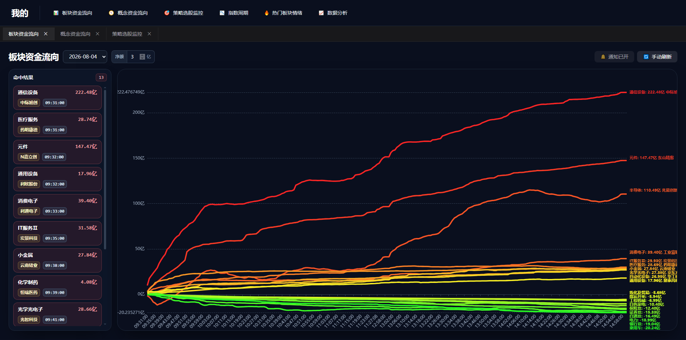

### 2.2 多策略选股监控（盯盘用）

- 可配置多条东方财富策略选股页面，包括策略名称、页面 URL、监听接口、启用状态、监控时间段和采集频率。
- 后台线程按每条策略自己的时间窗口和频率执行采集。
- 对采集结果进行股票代码规范化、去重和概念字段清洗。
- 记录当前入选名单、最新快照、每日历史快照、新增股票和移除股票，数据保存在 Redis。
- 前端可新增、编辑、启停、删除策略，也可手动刷新单条策略或全部启用策略。
- 页面展示当前入选数量、今日新增、最近入选时间、采集状态、股票字段和历史快照。
- 通过 SSE 实时推送名单变化，并可对新入选股票发送浏览器桌面通知。

作用：因为人工盯盘无法及时发现一些突破新高或者开在前高之上的机会，所以做了这个功能。可以实盘监控符合策略的股票，然后再去看是否可以买入。

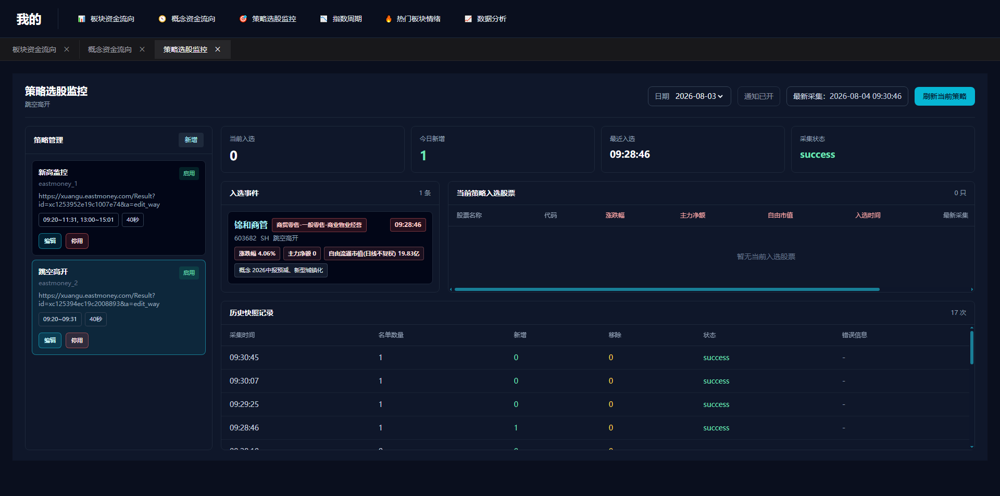

### 2.3 指数情绪周期（复盘用）

- 以本地上证指数日线和全市场日线数据为基础计算每日指数情绪。
- 评分由趋势、市场宽度、涨跌停结构、量能和风险偏好五部分组成。
- 根据分数和趋势条件划分退潮、冰点、弱修复、震荡、发酵、高潮、过热高潮等阶段。
- 统计上涨/下跌家数、涨跌停家数、市场成交额相对近 20 日比例等指标。
- 每日结果写入 MySQL，前端读取最新落库结果，展示摘要、情绪分、指数走势、近 10 日涨跌停对比和涨跌家数对比。

作用：收盘后观察今日的情绪和近期的情绪
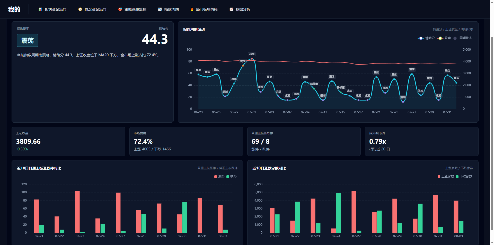
### 2.4 热门板块情绪（复盘用）

- 根据韭研公社异动数据识别近 30 个交易日的热门板块。
- 严格使用上一交易日实际落库的板块股票池，评估其下一交易日承接表现。
- 统计平均/中位涨跌幅、平均振幅、行情覆盖率、晋级率、红盘率、大跌率、炸板率和同板块留存率。
- 将板块划分为高潮、强势延续、良性承接、升温、分化、活跃、分歧、退潮、沉寂等状态，并生成情绪分和判定摘要。
- 前端支持按日期查看板块强弱排行、近 30 日多板块情绪对比、单板块近期走势和逐日明细。
- 入选数量、高潮数量、强势延续比例和排除板块均可在 `config.py` 中调整。

作用：收盘后观察今日哪些板块比较强，哪些比较弱，用来观察题材的运行阶段
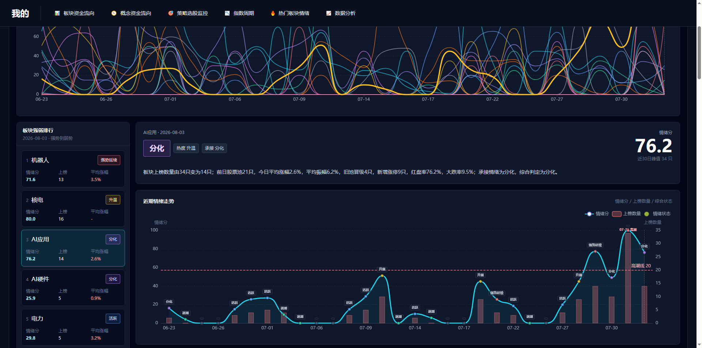
### 2.5 每日数据更新流水线（17:35后跑批）

正式入口 `stock_lab.jobs.daily_update` 负责收盘后的数据更新，`task/每日更新.py` 仅保留命令行和直接调用兼容。主服务在工作日 17:35 后触发检查；任务使用带过期时间的 Redis V1 锁和日期完成标记，防止同一天重复执行或多个任务并发执行。

默认流水线依次执行：

1. 更新 A 股基础信息。
2. 更新个股日 K 数据。
3. 更新上证指数日线。
4. 采集韭研公社异动板块数据。
5. 计算并写入热门板块情绪。
6. 计算并写入指数情绪周期和市场宽度。

项目还实现了 5 分钟 K 线、KDJ、同花顺行业/概念成分股、韭研公社异动和龙虎榜溢价分析等更新模块。5 分钟行情和 KDJ 的正式入口分别是 `stock_lab.jobs.intraday_bars_5m` 与 `stock_lab.jobs.kdj_indicators`；它们不在默认每日流水线中，需要按研究需要单独调用。

### 2.6 盘前纪要股票提取（盘前用，用来捕捉热启动的题材和隔夜消息）

- 正式入口 `stock_lab.jobs.premarket_summary` 接收注入的纪要来源和本地股票列表；公开仓库不包含韭研公社网络或浏览器 adapter，也不会伪造采集成功。
- 未配置来源时任务明确返回 `disabled`，不获取 Redis 锁、不写完成标记。为 worker 注入来源后，工作日 08:00 起才会进入定时检查。
- 从来源正文中匹配六位股票代码和本地股票名称，按首次出现顺序提取并去重。
- 将股票代码和名称生成可导入行情软件的 INI 名单，输出到 `output/韭研公社盘前纪要/<日期>/`。
- 使用带过期时间的 Redis V1 锁和日期完成标记，失败时释放锁且不标记完成。
- `task/盘前纪要.py` 保留 `韭研公社盘前纪要采集(...)` 作为直接调用兼容入口，调用方必须通过 `source=` 注入来源。

运行后会生成.ini格式的文件，可以直接用同花顺导入，非常方便和高效，不需要截图或者挨个去添加到板块中。
如20260804的盘前纪要，直接把文章中的相关股票导入到板块中，盘前可以节省很多时间。

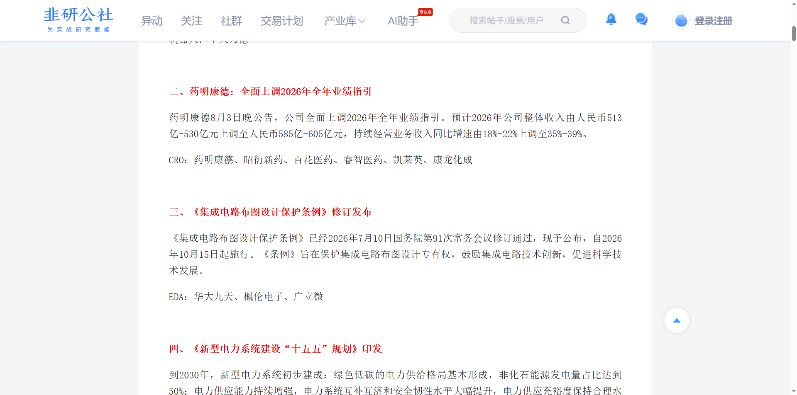
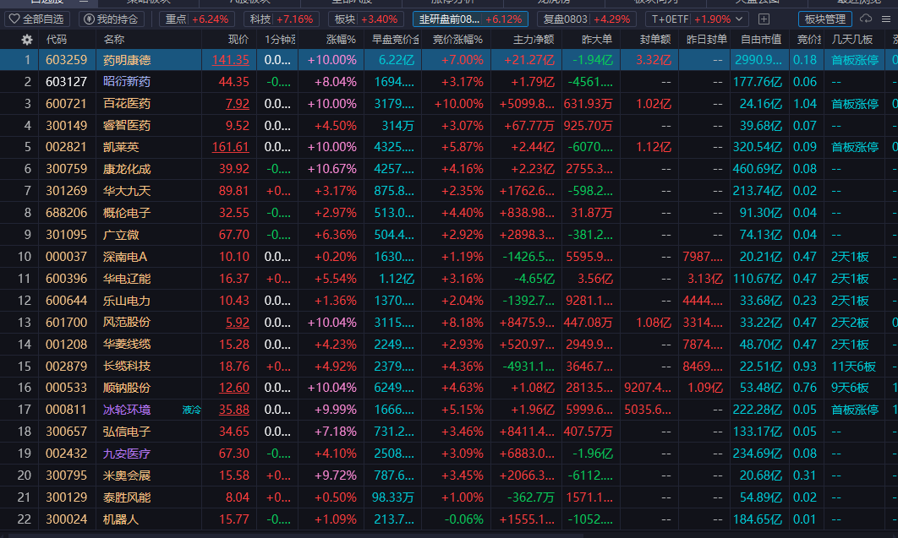
### 2.7 韭研公社异动采集（复盘用，用来发现哪些板块最强，以及板块中哪些是身位板和涨停时间强度）

`task/_5_韭研公社异动.py` 用于按交易日采集韭研公社异动榜单：

- 打开指定日期的异动页面，监听 `/jystock-app/api/v1/action/field` 接口响应。
- 解析板块名称、板块个股数量、题材说明，以及股票代码、股票名称、涨停时间、几天几板、涨幅和涨停解析。
- 仅保留涨幅在 9.5% 至 10.2% 之间的涨停附近股票，并写入 MySQL 表 `t_韭研公社异动解析`。
- 按连板身位、非连板板数和涨停时间排序，为每个板块生成单独的通达信 INI 股票名单。
- 将板块与同花顺行业/概念进行匹配，生成包含板块导入代码和去重股票的合并名单。
- 文件输出到 `output/韭研公社异动板块/<日期>/`，采集结果同时为热门板块情绪分析提供基础数据。

该步骤已经实现，但当前在默认每日更新流水线中被注释。需要启用时调用：

```python
_5_韭研公社异动.韭研公社异动采集(start_date)
```
运行后会生成.ini格式的文件，可以直接用同花顺导入，非常方便和高效，不需要截图或者挨个去添加到板块中。

如20260804，直接导入
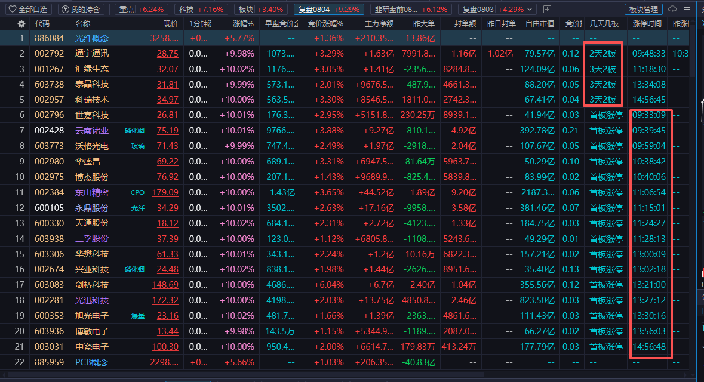
韭研
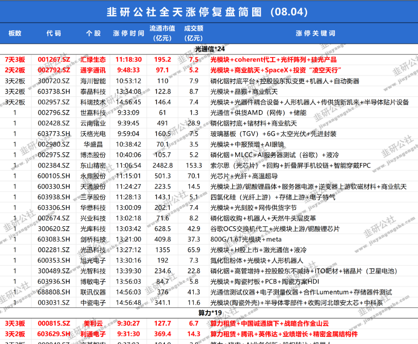

### 2.8 策略研究与回测（一些量价思想或者策略用，可以用来回测验证）

`strategy/` 保存了多组策略实验和验证脚本，覆盖量价齐升、趋势、新高、突破、缩量、止跌、DDE、龙虎榜、均线多头和龙头加速等方向。

公共研究能力包括：

- 从 MySQL 批量读取日线、5 分钟线、市值、KDJ、龙虎榜等数据。
- 计算均线、价格突破、量能、涨跌停、趋势强弱和市场过滤条件。
- 模拟买入、卖出、持仓、分仓、止损、止盈、盈利回撤和最大持仓天数。
- 统计收益率、胜率和账户净值，并使用 Plotly 或 CSV 输出研究结果。
- 通过策略模板集中配置回测日期、候选数量、仓位、买卖时点和风控阈值。

这些脚本主要是独立研究程序，不属于网页端实时策略管理功能。

官方研究入口为 `stock_lab.modules.research`：它提供注入式行情/龙虎榜数据访问、纯回测基础能力、57 个策略的静态英文标识注册表，以及不会自动连接数据库或网络的 CLI。未完成上下文迁移的中文兼容启动器会在导入前被安全拒绝；只有显式声明 `run(context)` 的策略才可运行。策略研究文档见 `docs/research-backtesting.md`。`strategy/` 中的中文文件继续作为兼容启动器，并保留中文展示名称。

常见比较好理解的策略有：新高策略、量窒息策略等。

样例：

策略概述：

前期上过多次龙虎榜，量窒息后收红入选，次日高开就买入，买入是分仓买，买入后t+1日如果回撤-1就卖出。 

脚本路径：
strategy/20260609_龙头缩量收红策略.py

以20260601~20260701为例。

可以通过日志查看，持仓明细：
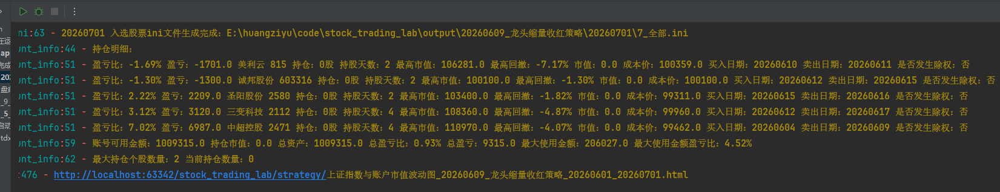
持仓收益率和与上证指数的走势观测
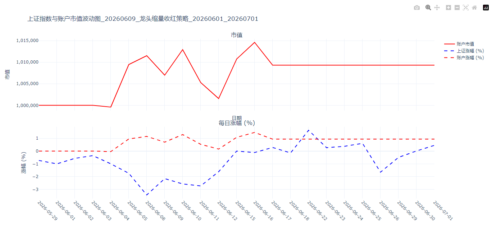
### 2.9 龙虎榜与游资溢价分析（复盘用）

- 采集龙虎榜明细、买卖席位、营业部历史上榜记录和营业部统计数据。
- 根据营业部历史买入后的价格表现估算席位平均溢价。
- 过滤低净买入额或样本不足的席位，识别单席位或多席位组合的高历史溢价股票。
- 提供多种龙虎榜选股、固定/动态分仓和是否允许重复买入的回测版本。

之前用来观察席位溢价用的，后来发现用处不大。

用来统计某一个区间时间内，这个席位买入后次日跟随买入的t+1日溢价情况。

以20260803为例，周期设置为20260404~20260803
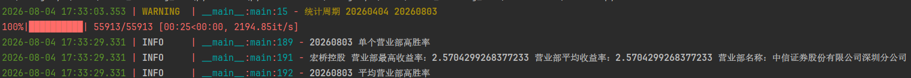

### 2.10 通达信本地行情与竞价监控（目前没开发到，计划用来盘中辅助交易的）

`stock_lab.infrastructure.tdx` 和 `stock_lab.modules.tdx` 是正式的通达信监控实现。`实时监控/tdx_全局监控.py` 和 `实时监控/tdx_竞价监控.py` 保留为可独立运行的兼容启动器：

- 只读通达信 `vipdoc` 下的日线和分钟线二进制文件。
- 通过通达信 `PYPlugins/user/tqcenter.py` 读取或订阅实时行情快照。
- 展示最新价、涨跌幅、开盘价、均价、成交额、竞价金额和未匹配金额。
- 可监控向上突破开盘价或分时均价，并进行日志/蜂鸣提醒。
- 集合竞价脚本可监控全体主板非 ST 股票，计算买卖量比、五档金额比、封单金额和封单变化，识别抢筹、封板、加封、减封等信号。
- 运行参数通过 `Settings`、`TDX_CODES` 和模块运行函数注入；兼容启动器可直接从 checkout 运行，也可使用 `uv run python 实时监控/tdx_全局监控.py`。

正式代码通过 `MarketDataRepository.securities()` 获取股票池，不直接导入 `config.py` 或 `PyMySQL`。测试使用临时二进制文件和 fake client，不需要安装通达信。

## 3. 系统结构

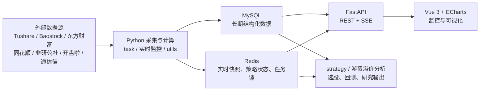

## 4. 技术栈

| 层次 | 主要技术 |
| --- | --- |
| 后端服务 | Python 3.12、FastAPI、Uvicorn |
| 数据处理 | pandas、NumPy、SQLAlchemy |
| 数据采集 | Tushare、Baostock、AkShare、Requests、BeautifulSoup、DrissionPage |
| 数据存储 | MySQL 8、Redis |
| 前端 | Vue 3、Vite、Tailwind CSS、ECharts |
| 研究输出 | Plotly、CSV、Excel、INI |
| 日志 | Loguru |

## 5. 主要目录

| 路径 | 作用 |
| --- | --- |
| `src/stock_lab/` | 正式 Python 包；包含应用启动、配置、基础设施、任务和业务模块 |
| `app.py` | 兼容启动入口；应用由 `stock_lab.bootstrap.application` 创建 |
| `front/` | Vue 前端，包含资金流向、策略监控、指数周期和热门板块情绪页面 |
| `实时监控/` | 迁移期兼容目录；新业务实现不再写入这里 |
| `task/` | 迁移期批量任务兼容目录 |
| `strategy/` | 待迁移的独立选股、回测和策略验证脚本 |
| `游资溢价分析/` | 待迁移的龙虎榜、营业部和历史溢价分析 |
| `utils/` | 迁移期兼容工具；MySQL 和 Redis 已转发到新基础设施层 |
| `db/migrations/` | 版本化英文数据库结构和存量数据迁移脚本 |
| `docs/` | 架构、开发、代码迁移和数据库迁移文档 |
| `init/` | MySQL/Redis Docker 配置和数据库初始化 SQL |
| `data/` | 股票基础数据、采集缓存和浏览器用户目录等本地数据 |
| `output/` | 研究 CSV、策略结果和盘前纪要 INI 等生成物 |
| `记录/` | 按月份保存的 Excel 记录 |

5 分钟行情通过 `IntradayBarSource` 注入数据源，默认 `BaoStockSource` 仅在实际采集时导入并登录 BaoStock。`fetch_intraday_bars_5m()` 只采集和标准化数据，`update_intraday_bars_5m()` 写入 `intraday_bars_5m`。`update_kdj_indicators()` 从 `daily_quotes` 计算标准 KDJ 并写入 `kdj_indicators`。旧的 `task._2_分时数据获取_5分k.get_data()` 只负责把正式结果投影为历史策略使用的列表顺序。

## 6. 数据存储分工

MySQL 负责保存需要长期查询和回测的结构化数据，主要包括：

- 股票基础信息、日 K、5 分钟 K、KDJ、市值和 DDE。
- 上证指数日线、市场宽度和指数情绪周期结果。
- 韭研公社异动、热门板块情绪分析。
- 龙虎榜、营业部历史和同花顺板块/成分股关系。

Redis 负责保存更新频繁或带运行状态的数据，主要包括：

- 行业/概念资金流向快照，使用 `fund_flow:v1:{flow_type}:history:{date}`、`fund_flow:v1:{flow_type}:dates` 和 `fund_flow:v1:stream`。
- 策略配置、当前选股名单、历史快照和入选事件；策略选股 V1 使用 `strategy_pick:v1:*` ASCII 键，旧 `策略选股:*` 键只由迁移 adapter 兼容读写。
- 每日更新和盘前纪要使用 `stock_lab:jobs:v1:daily_update:*` 与 `stock_lab:jobs:v1:premarket_summary:*` 保存执行锁和七天完成标记。

## 7. Web 页面与接口

| 页面 | 主要接口 | 当前状态 |
| --- | --- | --- |
| 板块资金流向 V1 | `/api/v1/fund-flow/industry/dates`、`/history/{date}`、`/api/v1/fund-flow/stream` | 英文字段，前端已切换 |
| 概念资金流向 V1 | `/api/v1/fund-flow/concept/dates`、`/history/{date}`、`/api/v1/fund-flow/stream` | 英文字段，前端已切换 |
| 策略选股监控 V1 | `/api/v1/strategy-pick/strategies`、`/latest`、`/history/{date}`、`/events/{date}`、`/dates`、`/refresh`、`/stream` | 英文字段，前端和 worker 已切换 |
| 指数情绪 V1 | `/api/v1/emotion/current` | 英文字段，前端已切换 |
| 热门板块情绪 V1 | `/api/v1/emotion/hot-boards` | 英文字段，前端已切换 |

旧 `/api/zijin/*`、`/api/emotion/*`、`/api/hot-board-emotion/*` 和 `/api/strategy-pick/*` 不再注册。资金流向和策略选股浏览器采集逻辑暂留在兼容文件中，通过官方 adapter 写入 V1 Redis，并在迁移期同步旧键供直接消费者使用。两类 SSE 都使用应用进程内 broker，由同一进程中的采集线程向 API 订阅者投递，并在连接关闭时清理订阅。

## 8. 运行条件与启动方式

运行前需要准备：

1. Python 3.12 和 `uv`，运行 `uv sync --all-groups --frozen` 安装依赖。
2. Node.js 与 npm，运行 `npm --prefix front install` 安装前端依赖。
3. MySQL 8 和 Redis；新环境使用 `init/stock_trading_lab_v2.sql`，旧库按 `docs/database-migrations.md` 迁移。
4. 复制 `.env.example` 为 `.env` 并配置 MySQL；可选集成按需要配置。
5. 确保需要采集的网站可访问；部分页面采集依赖本地浏览器会话。

项目根目录可直接运行：

```powershell
.\启动项目.ps1
```

`app.py` 默认启动 FastAPI 服务（8051 端口），并通过受管理的前端进程启动 Vite（8990 端口）。Vite 会把 `/api` 请求代理到 FastAPI。开发架构和命名规则见 `docs/architecture.md`。

## 9. 当前边界

- 部分数据任务和策略属于实验代码，已实现但没有接入默认定时流水线或 Web 页面。
- 前端当前由 Vite 开发服务器提供，仓库未配置独立的生产部署流程。
- 实时采集依赖第三方页面结构、接口和本地浏览器状态，网站改版后可能需要同步调整解析逻辑。
- 通达信监控依赖客户端及其 Python 插件缓存，未订阅或未刷新时可能读取到旧行情。
- 本项目用于数据研究与交易辅助，不构成投资建议。

